# 分支特殊说明: Curr Repo Notice
## 该分支要做

- [ ] 每一个仓库要分析的语言数量从写死改成参数化,让使用者自定义.
- [ ] 突破100限制: 实现所统计的用户涉及到的仓库数量超过100时, 实现发起可滚动Graphql来拉取所有仓库中的Top-language分析结果.再在项目中做二次聚合.
- [ ] Fork仓库中的贡献代码也统计到其中( 注意⚠️: 不包括他人的贡献代码量, 只统计当前用户的统计代码量 ), 并增加`withFork`参数

## 该分支已研究🧐
### 1. 加上`$endCursor`参数 和 `pageInfo` 响应字段实现滚动
适用情况:
* 使用 `私人专用Token` & `(公开仓库数量 + 非公开仓库数量) > 100` 
* 使用 `GitHub通用Token` & `公开仓库数量 > 100`

其中`私人专用Token`至少要保证拥有如下权限:(gist, read:org, repo, workflow)
##### 滚动开始:初次发起Graphql请求
初次发起Graphql请求时, 提供endCursor的值为null
```graphql
query userInfo($login: String!, $endCursor: String) {
    user (login: $login) {
        # fetch only owner repos & not forks
        repositories(ownerAffiliations: OWNER, isFork: false, first: 100, after: $endCursor) {
            nodes {
                name
                languages(first: 20, orderBy: {field: SIZE, direction: DESC}) {
                    edges {
                        size
                        node {
                            color
                            name                  
                        }                
                    }
                }
            }
            pageInfo {
                endCursor
                hasNextPage
            }
        }
    }
}
```
###### 请求体:
```json
{
  "query": "\n query userInfo($login: String!, $endCursor: String) {\n                   user (login: $login) {\n          # fetch only owner repos & not forks\n          repositories(ownerAffiliations: OWNER, isFork: false, first: 100, after: $endCursor) {\n            nodes {\n              name\n              languages(first: 20, orderBy: {field: SIZE, direction: DESC}) {\n                edges {\n                  size\n                  node {\n                    color\n                    name\n                  }\n                }\n              }\n            }\n    pageInfo {\n endCursor \n hasNextPage\n}      }\n        }\n      }\n      ",
  "variables": {
    "login": "Haoke98",
    "endCursor":null
  }
}
```
###### 结果:
收到响应体时, 不难发现有`pageInfo`如下:
```json
{
  ....
  "pageInfo": {
    "endCursor": "Y3Vyc29yOnYyOpHOK6vu7g==",
    "hasNextPage": false
  }
  ....
}
```
响应体:
```json
{
    "data": {
        "user": {
            "repositories": {
                "nodes": [
                    {
                        "name": "sadamlibrary_android",
                        "languages": {
                            "edges": [
                                {
                                    "size": 52262,
                                    "node": {
                                        "color": "#b07219",
                                        "name": "Java"
                                    }
                                }
                            ]
                        }
                    },
                    {
                        "name": "sadam_libray_java",
                        "languages": {
                            "edges": [
                                {
                                    "size": 1013,
                                    "node": {
                                        "color": "#b07219",
                                        "name": "Java"
                                    }
                                },
                                {
                                    "size": 97,
                                    "node": {
                                        "color": "#e34c26",
                                        "name": "HTML"
                                    }
                                }
                            ]
                        }
                    },
                    {
                        "name": "sadamlibrary-release",
                        "languages": {
                            "edges": [
                                {
                                    "size": 1179,
                                    "node": {
                                        "color": "#b07219",
                                        "name": "Java"
                                    }
                                }
                            ]
                        }
                    },
                    {
                        "name": "sadamlibrary_java_Module",
                        "languages": {
                            "edges": [
                                {
                                    "size": 811,
                                    "node": {
                                        "color": "#b07219",
                                        "name": "Java"
                                    }
                                }
                            ]
                        }
                    },
                    {
                        "name": "MasterProxier",
                        "languages": {
                            "edges": []
                        }
                    },
                    {
                        "name": "MasterCrawler",
                        "languages": {
                            "edges": [
                                {
                                    "size": 16540,
                                    "node": {
                                        "color": "#3572A5",
                                        "name": "Python"
                                    }
                                }
                            ]
                        }
                    },
                    {
                        "name": "UniversalToolKit",
                        "languages": {
                            "edges": [
                                {
                                    "size": 280554,
                                    "node": {
                                        "color": "#b07219",
                                        "name": "Java"
                                    }
                                }
                            ]
                        }
                    },
                    {
                        "name": "OSSRH-76419",
                        "languages": {
                            "edges": []
                        }
                    },
                    {
                        "name": "mvn-repo",
                        "languages": {
                            "edges": []
                        }
                    },
                    {
                        "name": "UniversalFormatKit",
                        "languages": {
                            "edges": [
                                {
                                    "size": 2404,
                                    "node": {
                                        "color": "#3572A5",
                                        "name": "Python"
                                    }
                                }
                            ]
                        }
                    },
                    {
                        "name": "PUD",
                        "languages": {
                            "edges": []
                        }
                    },
                    {
                        "name": "jpl-backend-springboot",
                        "languages": {
                            "edges": []
                        }
                    },
                    {
                        "name": "ElasticSearchHelper",
                        "languages": {
                            "edges": [
                                {
                                    "size": 2615,
                                    "node": {
                                        "color": "#3572A5",
                                        "name": "Python"
                                    }
                                }
                            ]
                        }
                    },
                    {
                        "name": "super-http-catcher",
                        "languages": {
                            "edges": [
                                {
                                    "size": 3734,
                                    "node": {
                                        "color": "#f1e05a",
                                        "name": "JavaScript"
                                    }
                                }
                            ]
                        }
                    },
                    {
                        "name": "NetTools",
                        "languages": {
                            "edges": [
                                {
                                    "size": 22603,
                                    "node": {
                                        "color": "#3572A5",
                                        "name": "Python"
                                    }
                                }
                            ]
                        }
                    },
                    {
                        "name": "SpaceManager",
                        "languages": {
                            "edges": [
                                {
                                    "size": 5118,
                                    "node": {
                                        "color": "#3572A5",
                                        "name": "Python"
                                    }
                                }
                            ]
                        }
                    },
                    {
                        "name": "LogAnalyser",
                        "languages": {
                            "edges": [
                                {
                                    "size": 94287,
                                    "node": {
                                        "color": "#e34c26",
                                        "name": "HTML"
                                    }
                                },
                                {
                                    "size": 10545,
                                    "node": {
                                        "color": "#3572A5",
                                        "name": "Python"
                                    }
                                }
                            ]
                        }
                    },
                    {
                        "name": "icloud-killer",
                        "languages": {
                            "edges": [
                                {
                                    "size": 17772,
                                    "node": {
                                        "color": "#3572A5",
                                        "name": "Python"
                                    }
                                }
                            ]
                        }
                    },
                    {
                        "name": "AllKeeper",
                        "languages": {
                            "edges": [
                                {
                                    "size": 335514,
                                    "node": {
                                        "color": "#3572A5",
                                        "name": "Python"
                                    }
                                },
                                {
                                    "size": 133269,
                                    "node": {
                                        "color": "#e34c26",
                                        "name": "HTML"
                                    }
                                },
                                {
                                    "size": 5383,
                                    "node": {
                                        "color": "#f1e05a",
                                        "name": "JavaScript"
                                    }
                                },
                                {
                                    "size": 1950,
                                    "node": {
                                        "color": "#89e051",
                                        "name": "Shell"
                                    }
                                },
                                {
                                    "size": 39,
                                    "node": {
                                        "color": "#C1F12E",
                                        "name": "Batchfile"
                                    }
                                }
                            ]
                        }
                    },
                    {
                        "name": "env-builder",
                        "languages": {
                            "edges": [
                                {
                                    "size": 1979,
                                    "node": {
                                        "color": "#89e051",
                                        "name": "Shell"
                                    }
                                }
                            ]
                        }
                    },
                    {
                        "name": "clash-regional-configuration",
                        "languages": {
                            "edges": []
                        }
                    },
                    {
                        "name": "sproxy",
                        "languages": {
                            "edges": [
                                {
                                    "size": 112847,
                                    "node": {
                                        "color": "#f1e05a",
                                        "name": "JavaScript"
                                    }
                                }
                            ]
                        }
                    },
                    {
                        "name": "electron-builder",
                        "languages": {
                            "edges": [
                                {
                                    "size": 937,
                                    "node": {
                                        "color": "#f1e05a",
                                        "name": "JavaScript"
                                    }
                                },
                                {
                                    "size": 448,
                                    "node": {
                                        "color": "#e34c26",
                                        "name": "HTML"
                                    }
                                }
                            ]
                        }
                    },
                    {
                        "name": "DjangoAsyncAdmin",
                        "languages": {
                            "edges": [
                                {
                                    "size": 35774351,
                                    "node": {
                                        "color": "#f1e05a",
                                        "name": "JavaScript"
                                    }
                                },
                                {
                                    "size": 248007,
                                    "node": {
                                        "color": "#563d7c",
                                        "name": "CSS"
                                    }
                                },
                                {
                                    "size": 209269,
                                    "node": {
                                        "color": "#e34c26",
                                        "name": "HTML"
                                    }
                                },
                                {
                                    "size": 158833,
                                    "node": {
                                        "color": "#3572A5",
                                        "name": "Python"
                                    }
                                },
                                {
                                    "size": 19973,
                                    "node": {
                                        "color": "#1d365d",
                                        "name": "Less"
                                    }
                                },
                                {
                                    "size": 308,
                                    "node": {
                                        "color": "#89e051",
                                        "name": "Shell"
                                    }
                                }
                            ]
                        }
                    },
                    {
                        "name": "pdf-tools",
                        "languages": {
                            "edges": [
                                {
                                    "size": 4362,
                                    "node": {
                                        "color": "#3572A5",
                                        "name": "Python"
                                    }
                                }
                            ]
                        }
                    },
                    {
                        "name": "Haoke98",
                        "languages": {
                            "edges": []
                        }
                    },
                    {
                        "name": "TestX",
                        "languages": {
                            "edges": []
                        }
                    },
                    {
                        "name": "NetEye",
                        "languages": {
                            "edges": []
                        }
                    },
                    {
                        "name": "DjangoAsyncAdmin-docs",
                        "languages": {
                            "edges": []
                        }
                    }
                ],
                "pageInfo": {
                    "endCursor": "Y3Vyc29yOnYyOpHOK6vu7g==",
                    "hasNextPage": false
                }
            }
        }
    }
}
```

接着访问:
```json
{
  "query": "\n  query userInfo($login: String!, $endCursor: String) {\n                   user (login: $login) {\n          # fetch only owner repos & not forks\n          repositories(ownerAffiliations: OWNER, isFork: false, first: 100, after: $endCursor) {\n            nodes {\n              name\n              languages(first: 20, orderBy: {field: SIZE, direction: DESC}) {\n                edges {\n                  size\n                  node {\n                    color\n                    name\n                  }\n                }\n              }\n            }\n    pageInfo {\n endCursor \n hasNextPage\n}      }\n        }\n      }\n      ",
  "variables": {
    "login": "Haoke98",
    "endCursor":"Y3Vyc29yOnYyOpHOK6vu7g=="
  }
}
```
结果:
```json
{
    "data": {
        "user": {
            "repositories": {
                "nodes": [],
                "pageInfo": {
                    "endCursor": null,
                    "hasNextPage": false
                }
            }
        }
    }
}
```

## 将要实现
### 1.分析`Top-langs`时把Fork Repo中的贡献代码的量也一起计算
#### 目前存在的问题:
##### 1. 当`isFork:true`时, 把Fork仓库中的其他人的贡献代码也计算到其中, 导致计算结果超乎想象并且相当的庞大.
<table>
<tr>
<th>调用方式</th>
<th>isFork:false</th>
<th>isFork:true</th>
</tr>
<tr>
<td>直接调用</td>
<td></td>
<td>目前无法获取:官方没有实现,强制不计算Fork仓库</td>
</tr>

<tr>
<td rowspan="2">Personal access token</td>
<td>
    仓库: 45, Graphql: 45, 过滤后: 12<br/>
    语言: 11, 限制后: 11
</td>
<td>
    仓库: 148, Graphql: 100(被限制了), 过滤后: 15 <br/>
    语言: 71, 限制后: 20
</td>

</tr>
<tr>
<td></td>
<td>
    
</td>
</tr>
</table>

## 知识点:
### `Personal access token` 和 直接调用 对比
<table>
<tr>
<th>直接调用</th>
<th>Personal access token</th>
</tr>
<tr>
<td>只分析所有公开仓库(不包含私有非公开仓库)</td>
<td>分析所有仓库(包括公开和非公开仓库)</td>
</tr>
<tr>
<td></td>
<td></td>
</tr>
</table>

### 一个Token既 Own Private 又 GitHub All Public
用自己的 专属Token(权限至少要包括:gist, read:org, repo, workflow) 不仅可以分析出自己的所有仓库(包括私有private仓库) 还可以分析出GitHub上其他用户的Public仓库
### 算法&权重: Algorithm & Weight
<table>
<tr>
<th>默认:Default</th>
<th>推荐:Recommend</th>
<th>不推荐</th>
</tr>
<tr>
<td>按代码文件的大小排序:Orders by size</td>
<td>平衡, 既按代码文件的大小又按仓库数量排序</td>
<td>按仓库数量排序:Orders by repo count</td>
</tr>
<tr>
<td></td>
<td></td>
<td></td>
</tr>
</table>

* 💡同一个语言有多个仓库说明, 上手过同一种语言的多种项目, 更能体现个人在该语言方面的综合能力.

